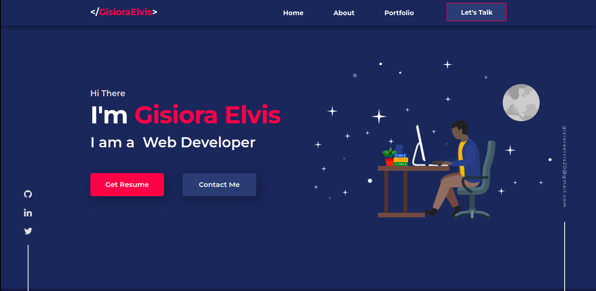
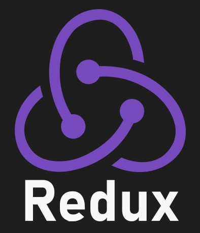
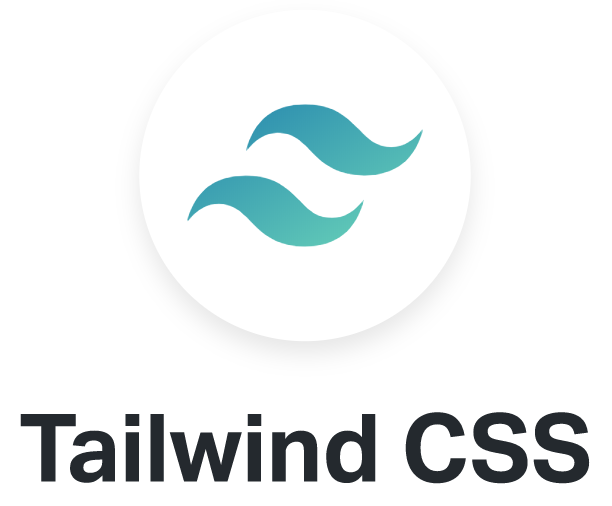
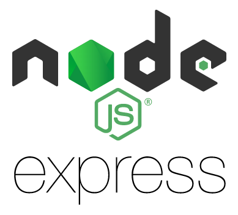
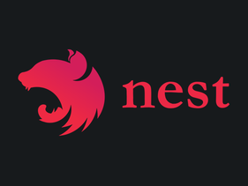
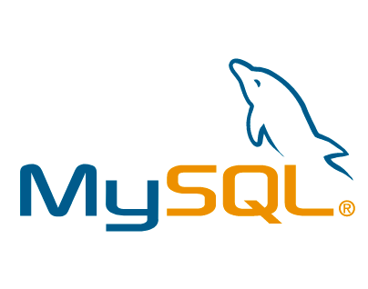
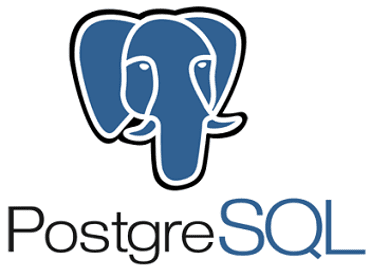

    <h1> Hi,  
        
    </h1>
    
     
    

        🙏🏻 Welcome to my Github Profile! 
        I am a <b>Web Developer</b> 🚀 . 
        I love experimenting and building with Tech 😍 
    

    

        
        
        
    

    

        <h2>
            
            What I'm up to currently
        </h2>
        <ul>
            
 
            👨🏻‍ Pursuing Bsc. Computer Science at Egerton Universty Kenya ✍🏻 💻
            

        </ul>
    

    

        <h2>🧰 Languages & Tools I've Worked With So Far</h2>
        

            
            &nbsp;
            
            &nbsp;
            
            &nbsp;
            
            &nbsp;
            
            &nbsp;
            
            &nbsp;
            
            &nbsp;
            
            &nbsp;
            
            &nbsp;
            
            &nbsp;
            
            &nbsp;
            
            &nbsp;
            
            &nbsp;
            
            &nbsp;
            
            &nbsp;
            
            &nbsp;
            
            &nbsp;
        

    

